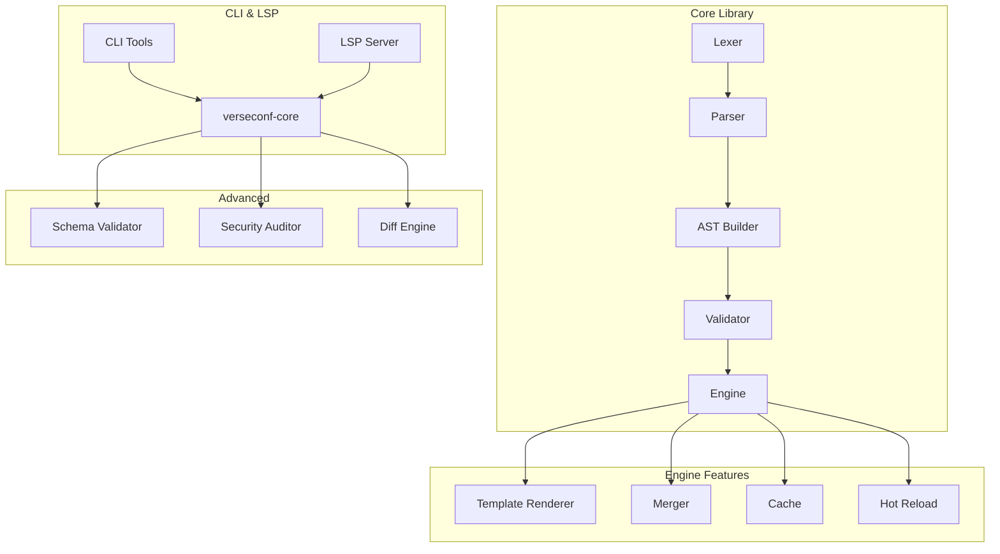

# 🎭 VerseConf

### *A modern configuration language for the AI era.*

[](https://github.com/Baixu22/Verse-conf)
[](LICENSE)
[](https://www.rust-lang.org)
[](#testing)

> **VerseConf** is a next-generation configuration format built in Rust, designed to solve real-world configuration challenges while being AI-friendly.

---

## 🚨 The Problem

Managing configuration files today faces critical challenges:

| Challenge | Description |
|-----------|-------------|
| 🔄 **Repetition** | Duplicating values across environments (dev/staging/prod) |
| 🧮 **Complexity** | No support for expressions or calculations |
| 📝 **Maintainability** | No comments, poor error messages, hard to refactor |
| 🔐 **Security** | Sensitive data leaks in plain text |
| 🤖 **AI Integration** | LLMs struggle with rigid formats lacking context |

---

## 💡 Our Solution

VerseConf addresses these with innovative features:

<div align="center">

| Feature | Description |
|---------|-------------|
| ⚡ **Expressions** | `${port + 1}`, `${1h + 30m}` - compute values dynamically |
| 📋 **Templates** | Inheritance and composition for environment management |
| 📦 **@include** | Split configs across files with merge strategies |
| 📄 **Schema** | Type validation with AI hints (`llm_hint`, `sensitive`) |
| 🔥 **Hot Reload** | Watch files and reload without restart |
| 🔍 **Security Audit** | Detect secrets and unsafe configurations |
| 💻 **LSP Support** | Full IDE integration with autocomplete and diagnostics |

</div>

---

## ⚡ Performance

```
VerseConf vs TOML vs JSON (parsing time)

small:   VCF 103μs  |  TOML 421μs (4.1x slower)  |  JSON 10μs
large:   VCF 6.7ms  |  TOML 18.9ms (2.8x slower) |  JSON 3.0ms
```

**🚀 2.8-4.1x faster than TOML** with significantly more features.

---

## 🚀 Quick Start

```bash
# Install CLI
cargo install verseconf-cli

# Parse and validate
verseconf parse config.vcf
verseconf validate config.vcf --strict

# Format with AI-friendly output
verseconf format config.vcf --ai-canonical

# Generate documentation from schema
verseconf doc config.vcf
```

---

## 📖 Example Configuration

```vcf
#@schema {
  version = "1.0"

  app_name {
    type = "string"
    required = true
    desc = "Application name"
    llm_hint = "Use lowercase with hyphens"
  }

  port {
    type = "integer"
    default = 8080
    range = 1024..65535
    sensitive = false
  }
}

# Application Configuration
app_name = "my-service"
port = 8080

# Dynamic values with expressions
health_port = ${port + 1}
timeout = ${30s + 500ms}

# Environment-specific includes
@include "database.vcf" merge=deep_merge

# Template with inheritance
server {
  host = ${ENV:HOSTNAME}  # Environment variable interpolation
  workers = ${cpu_cores * 2}
}
```

---

## 🏗️ Architecture



---

## 📁 Project Structure

```
verseconf/
├── crates/
│   ├── verseconf-core/     # Core parser and engine  ⚙️
│   ├── verseconf-cli/      # Command-line tools  🖥️
│   ├── verseconf-lsp/      # LSP server implementation  💡
│   └── verseconf-test/     # Test suite & benchmarks  🧪
├── examples/               # Example configurations  📂
└── compare/               # Performance comparison tools  📊
```

---

## 🧩 Core Components

| Module | Path | Purpose |
|--------|------|---------|
| 🔤 Lexer | `crates/verseconf-core/src/lexer/` | Tokenization with context awareness |
| 📝 Parser | `crates/verseconf-core/src/parser/` | PEG-based syntax analysis |
| 🌳 AST | `crates/verseconf-core/src/ast/` | Abstract syntax tree definitions |
| ⚙️ Engine | `crates/verseconf-core/src/engine/` | Template, cache, merge, hot-reload |
| 💻 LSP | `crates/verseconf-lsp/src/` | Language server protocol |

---

## 🧪 Testing

```bash
# Run all tests
cargo test --workspace

# Run benchmarks
cargo bench

# Performance comparison
cd compare && cargo run --bin benchmark
```

> **📊 Current Status**: 161/161 tests passing ✅

---

## 📚 Documentation

| Document | Description |
|----------|-------------|
| 📄 [Language Specification](docs/SPECIFICATION.md) | Complete syntax reference |
| 📘 [Tutorial](docs/TUTORIAL.md) | Getting started guide |
| 📚 [API Documentation](https://docs.rs/verseconf-core) | Rust API docs |

---

## 📦 JavaScript / TypeScript

```bash
npm install verseconf
```

```typescript
import { VerseConf, parseConfig, getVersion } from 'verseconf';

// Parse VCF content
const config = new VerseConf(`
  app_name = "my-service"
  port = 8080
`);

// Get values
config.getString('app_name')  // "my-service"
config.getNumber('port')     // 8080

// Or use the parse function
const config2 = parseConfig(`
  database {
    host = "localhost"
    port = 5432
  }
`);

config2.getString('database.host')  // "localhost"
config2.getNumber('database.port')   // 5432
config2.toJson()                    // Convert to JSON

getVersion()  // "0.1.0"
```

**CDN Usage (Browser):**
```html
<script type="module">
  import init, { VerseConf } from 'https://cdn.jsdelivr.net/npm/verseconf/dist/index.mjs';
  await init();

  const config = new VerseConf('app_name = "my-app"');
  console.log(config.getString('app_name'));
</script>
```

---

## 🧩 VSCode Extension

Install the official VerseConf extension for syntax highlighting, autocomplete, and validation in Visual Studio Code.

**Installation:**
1. Open VSCode
2. Press `Ctrl+Shift+X` (or `Cmd+Shift+X` on Mac) to open Extensions
3. Search for **"VerseConf"**
4. Click **Install**

**Or install from .vsix file:**
```bash
code --install-extension extensions/verseconf-vscode/verseconf-0.1.0.vsix
```

**Features:**
- 🎨 Syntax highlighting for `.vcf` files
- ✨ Auto-completion and IntelliSense
- 🔍 Real-time validation
- 💡 LSP-powered diagnostics
- 📄 Schema support

---

## 🤝 Contributing

Contributions are welcome! Please feel free to submit a Pull Request.

---

## 📄 License

<div align="center">

[](LICENSE)

**MIT OR Apache-2.0**

</div>

---

<div align="center">

**VerseConf**: Configure smarter, not harder. ✨

*Made with ❤️ in Rust*

</div>
