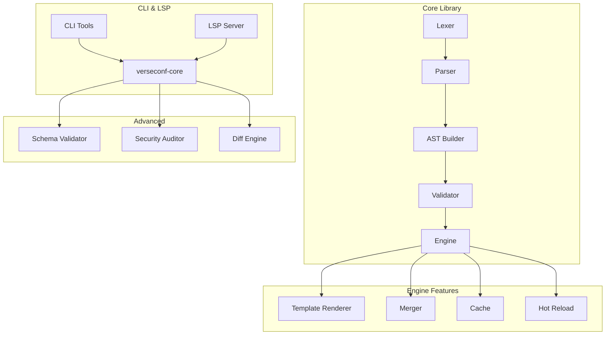

# 🎭 VerseConf

### *A modern configuration language for the AI era.*

[](https://github.com/Baixu22/Verse-conf)
[](LICENSE)
[](https://www.rust-lang.org)
[](https://github.com/Baixu22/Verse-conf/actions/workflows/ci.yml)

> **VerseConf** is a next-generation configuration format built in Rust, designed to solve real-world configuration challenges while being AI-friendly.

---

## 🚨 The Problem

Managing configuration files today faces critical challenges:

| Challenge | Description |
|-----------|-------------|
| 🔄 **Repetition** | Duplicating values across environments (dev/staging/prod) |
| 🧮 **Complexity** | No support for expressions or calculations |
| 📝 **Maintainability** | No comments, poor error messages, hard to refactor |
| 🔐 **Security** | Sensitive data leaks in plain text |
| 🤖 **AI Integration** | LLMs struggle with rigid formats lacking context |

---

## 💡 Our Solution

VerseConf addresses these with innovative features:

<div align="center">

| Feature | Description |
|---------|-------------|
| ⚡ **Expressions** | `${port + 1}`, `${1h + 30m}` - compute values dynamically |
| 📋 **Templates** | Inheritance and composition for environment management |
| 📦 **@include** | Split configs across files with merge strategies |
| 📄 **Schema** | Type validation with AI hints (`llm_hint`, `sensitive`) |
| 🔥 **Hot Reload** | Watch files and reload without restart |
| 🔍 **Security Audit** | Detect secrets and unsafe configurations |
| 💻 **LSP Support** | Full IDE integration with autocomplete and diagnostics |

</div>

---

## ⚡ Performance

解析耗时由 `compare/` 下的基准真实产出。下面这张表来自本机一次 release 运行
（Windows 10 / AMD64 / AMD64 Family 25 Model 97 Stepping 2 / rustc 1.98.1，
每个格式 5 轮取中位数）：

| 数据集 | VerseConf | TOML | JSON | TOML/VCF | JSON/VCF |
|---------|-----------|------|------|----------|----------|
| small (426B)  | 9.55μs   | 13.51μs  | 1.96μs   | 1.42x | 0.20x |
| medium (2.5KB) | 78.51μs | 96.99μs  | 13.89μs  | 1.24x | 0.18x |
| large (24.8KB) | 756.34μs | 950.42μs | 197.13μs | 1.26x | 0.26x |
| xlarge (263KB) | 6.82ms  | 8.49ms   | 2.46ms   | 1.25x | 0.36x |

**VerseConf 的解析速度约为 TOML 的 1.24–1.42 倍。** `serde_json` 比三者都快，
VerseConf 比它慢约 2.8–5.0 倍。三种格式的语料是同一份配置的等价写法。

复现（数字会随硬件变化）：

```bash
cargo run -p verseconf-compare --bin generate_test_data
cargo run --release -p verseconf-compare --bin benchmark -- --json compare/benchmark_results.json
python3 compare/generate_charts.py
```

`compare/benchmark_results.json` 是上面这张表的数据来源，
`compare/performance_charts.md` 由它生成。基准在数据缺失或解析失败时直接报错
退出，不会退化成 0。

---

## 🚀 Quick Start

```bash
# 安装 CLI（可执行文件叫 verseconf）
cargo install verseconf-cli

# 或者从克隆的仓库安装
# cargo install --path crates/verseconf-cli

# Parse and validate
verseconf parse config.vcf
verseconf validate config.vcf --strict

# Format with AI-friendly output
verseconf format config.vcf --ai-canonical

# Generate documentation from schema
verseconf doc config.vcf
```

---

## 🔧 从源码构建

克隆之后一条命令完成构建与测试（工作区全部 crate，265 个用例）：

```bash
cargo test --workspace
```

发布到 crates.io 的顺序（需要 `CARGO_REGISTRY_TOKEN`）：

```bash
cargo publish -p verseconf-core   # 其余 crate 都依赖它，必须第一个发
cargo publish -p verseconf-cli    # 提供 `verseconf` 可执行文件
cargo publish -p verseconf-mcp    # 工具协议服务端
cargo publish -p verseconf-lsp    # 编辑器语言服务器
```

`cargo package --workspace` 可以在不发布的情况下检查打包内容与清单是否合法。

---

## 📖 Example Configuration

```vcf
#@schema {
  version = "1.0"

  app_name {
    type = "string"
    required = true
    desc = "Application name"
    llm_hint = "Use lowercase with hyphens"
  }

  port {
    type = "integer"
    default = 8080
    range = 1024..65535
    sensitive = false
  }
}

# Application Configuration
app_name = "my-service"
port = 8080

# Dynamic values with expressions
health_port = ${port + 1}
timeout = ${30s + 500ms}

# Environment-specific includes
@include "database.vcf" merge=deep_merge

# Template with inheritance
server {
  host = ${ENV:HOSTNAME}  # Environment variable interpolation
  workers = ${cpu_cores * 2}
}
```

---

## 🏗️ Architecture


```mermaid
graph TB
    subgraph "Core Library"
        L[Lexer] --> P[Parser]
        P --> AST[AST Builder]
        AST --> V[Validator]
        V --> E[Engine]
    end

    subgraph "Engine Features"
        E --> T[Template Renderer]
        E --> M[Merger]
        E --> C[Cache]
        E --> H[Hot Reload]
    end

    subgraph "CLI & LSP"
        CLI[CLI Tools] --> Core[verseconf-core]
        LSP[LSP Server] --> Core
    end

    subgraph "Advanced"
        S[Schema Validator]
        A[Security Auditor]
        D[Diff Engine]
    end

    Core --> S
    Core --> A
    Core --> D
```

---

## 📁 Project Structure

```
verseconf/
├── crates/
│   ├── verseconf-core/     # Core parser and engine  ⚙️
│   ├── verseconf-cli/      # Command-line tools  🖥️
│   ├── verseconf-lsp/      # LSP server implementation  💡
│   └── verseconf-test/     # Test suite & benchmarks  🧪
├── examples/               # Example configurations  📂
└── compare/               # Performance comparison tools  📊
```

---

## 🧩 Core Components

| Module | Path | Purpose |
|--------|------|---------|
| 🔤 Lexer | `crates/verseconf-core/src/lexer/` | Tokenization with context awareness |
| 📝 Parser | `crates/verseconf-core/src/parser/` | PEG-based syntax analysis |
| 🌳 AST | `crates/verseconf-core/src/ast/` | Abstract syntax tree definitions |
| ⚙️ Engine | `crates/verseconf-core/src/engine/` | Template, cache, merge, hot-reload |
| 💻 LSP | `crates/verseconf-lsp/src/` | Language server protocol |

---

## 🧪 Testing

```bash
# Run all tests
cargo test --workspace

# Run benchmarks
cargo bench

# Performance comparison（数字由基准真实产出，见 compare/performance_charts.md）
cargo run -p verseconf-compare --bin generate_test_data
cargo run --release -p verseconf-compare --bin benchmark -- --json compare/benchmark_results.json
python3 compare/generate_charts.py
```

> **📊 Current Status**: `cargo test --workspace` 265/265 通过 ✅

---

## 📚 Documentation

| Document | Description |
|----------|-------------|
| 📄 [Language Specification](docs/SPECIFICATION.md) | Complete syntax reference |
| 📘 [Tutorial](docs/TUTORIAL.md) | Getting started guide |
| 📚 [API Documentation](https://docs.rs/verseconf-core) | Rust API docs |

---

## 📦 JavaScript / TypeScript

```bash
npm install verseconf
```

CommonJS 与 ESM 两种引入方式都可用（包内自带 WebAssembly，无需编译）：

```typescript
import { VerseConf, parseConfig, getVersion } from 'verseconf';

// Parse VCF content
const config = new VerseConf(`
  app_name = "my-service"
  port = 8080
`);

// Get values
config.getString('app_name')  // "my-service"
config.getNumber('port')     // 8080

// Or use the parse function
const config2 = parseConfig(`
  database {
    host = "localhost"
    port = 5432
  }
`);

config2.getString('database.host')  // "localhost"
config2.getNumber('database.port')   // 5432
config2.toJson()                    // Convert to JSON

getVersion()  // 内嵌 Rust 核心的版本
```

包内还带着与本机 `verseconf-mcp` **完全相同**的四个工具（校验、安全审计、
意图应用、区间编辑），结果逐字节一致：

```typescript
import { validate, audit, applyEdit, editRange } from 'verseconf';

validate('port = 8080\n');            // { isError: false, structuredContent: { valid: true, ... } }
audit('db_password = "secret"\n');    // structuredContent.findings -> [{ rule_id: 'SEC-SENS-001', ... }]
```

**零安装的工具协议服务端**（宿主只要有 Node，不需要 Rust 工具链）：

```bash
npx verseconf-mcp-wasm --list-tools
npx verseconf-mcp-wasm            # 逐行 JSON-RPC over stdio
```

```json
{ "mcpServers": { "verseconf": { "command": "npx", "args": ["-y", "verseconf-mcp-wasm"] } } }
```

详见 [docs/MCP.md](docs/MCP.md)。

**CDN Usage (Browser):** 浏览器用 wasm-bindgen 的 web 目标产物 `pkg-web/`：

```html
<script type="module">
  import init, { call_tool_json } from 'https://cdn.jsdelivr.net/npm/verseconf/pkg-web/verseconf_wasm.js';
  await init();

  const result = JSON.parse(call_tool_json('verseconf_validate', JSON.stringify({ source: 'port = 8080\n' })));
  console.log(result.structuredContent.valid);  // true
</script>
```

---

## 🧩 VSCode Extension

VerseConf 的编辑器支持：语法高亮、实时诊断、格式化。扩展包由流水线产出，
按平台自带语言服务器。

**从扩展包安装：**

```bash
code --install-extension verseconf-0.1.0.vsix
```

扩展包由 `.github/workflows/extension.yml` 产出：矩阵构建
`linux-x64` / `win32-x64` / `darwin-x64` / `darwin-arm64` 四份语言服务器，
聚合后打包并作为构建产物上传。本地打包见
[extensions/verseconf-vscode/README.md](extensions/verseconf-vscode/README.md)。

**Features:**
- 🎨 Syntax highlighting for `.vcf` files
- ✨ Auto-completion and IntelliSense
- 🔍 Real-time validation
- 💡 LSP-powered diagnostics
- 📄 Schema support

---

## 🤝 Contributing

Contributions are welcome! Please feel free to submit a Pull Request.

---

## 📄 License

<div align="center">

[](LICENSE)

**MIT OR Apache-2.0**

</div>

---

<div align="center">

**VerseConf**: Configure smarter, not harder. ✨

*Made with ❤️ in Rust*

</div>
